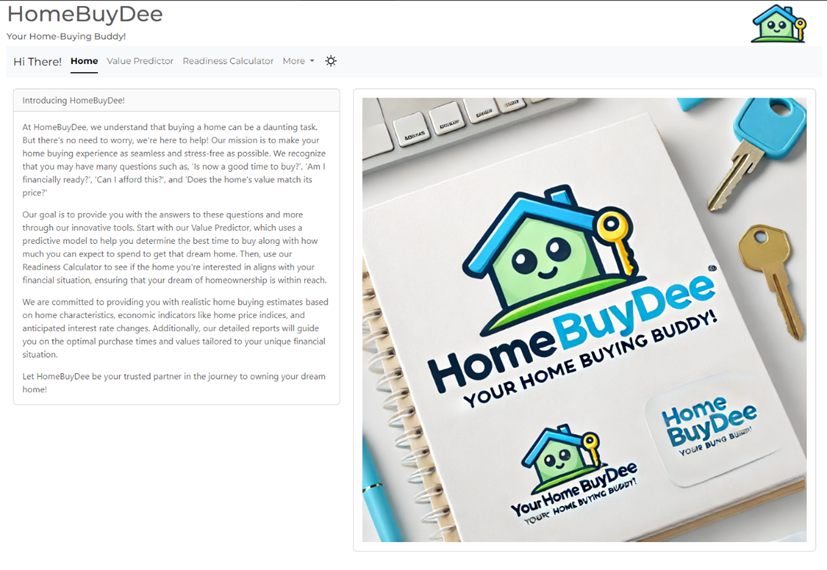
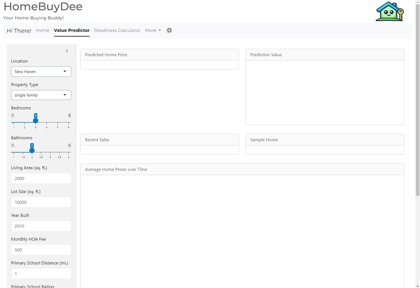
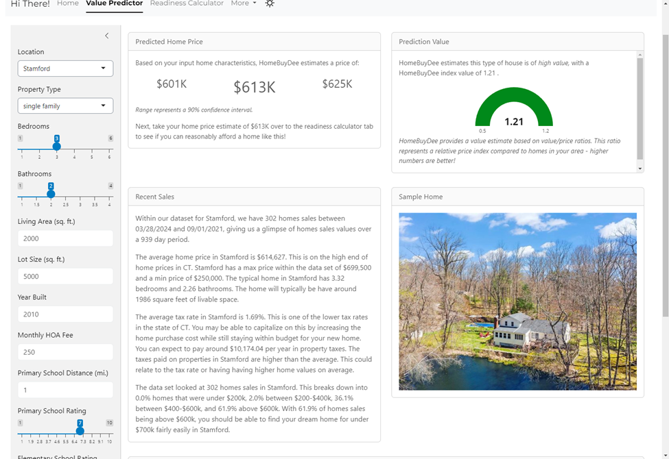
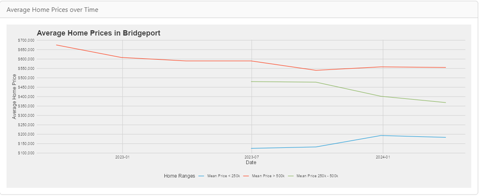
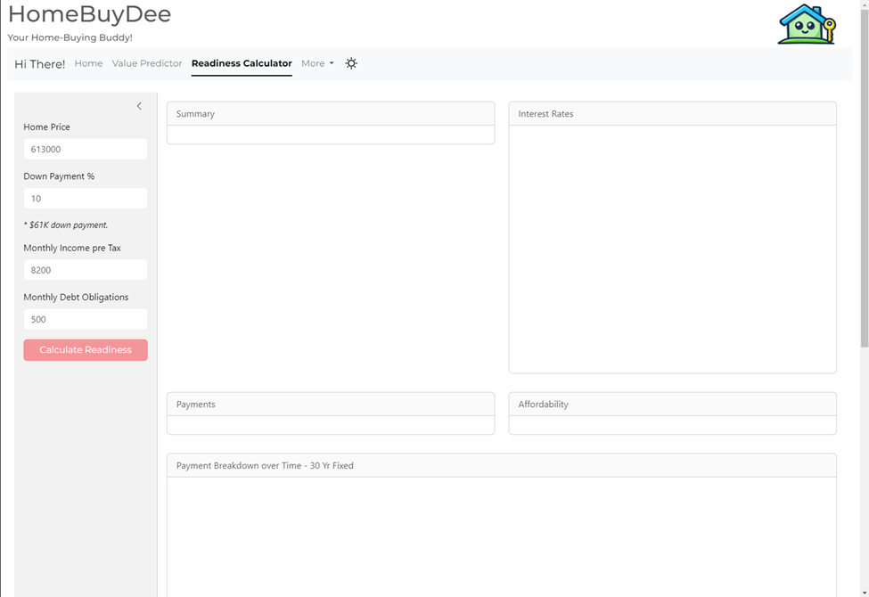
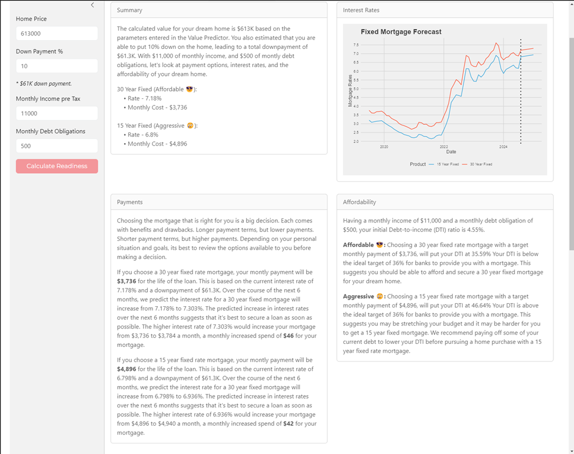
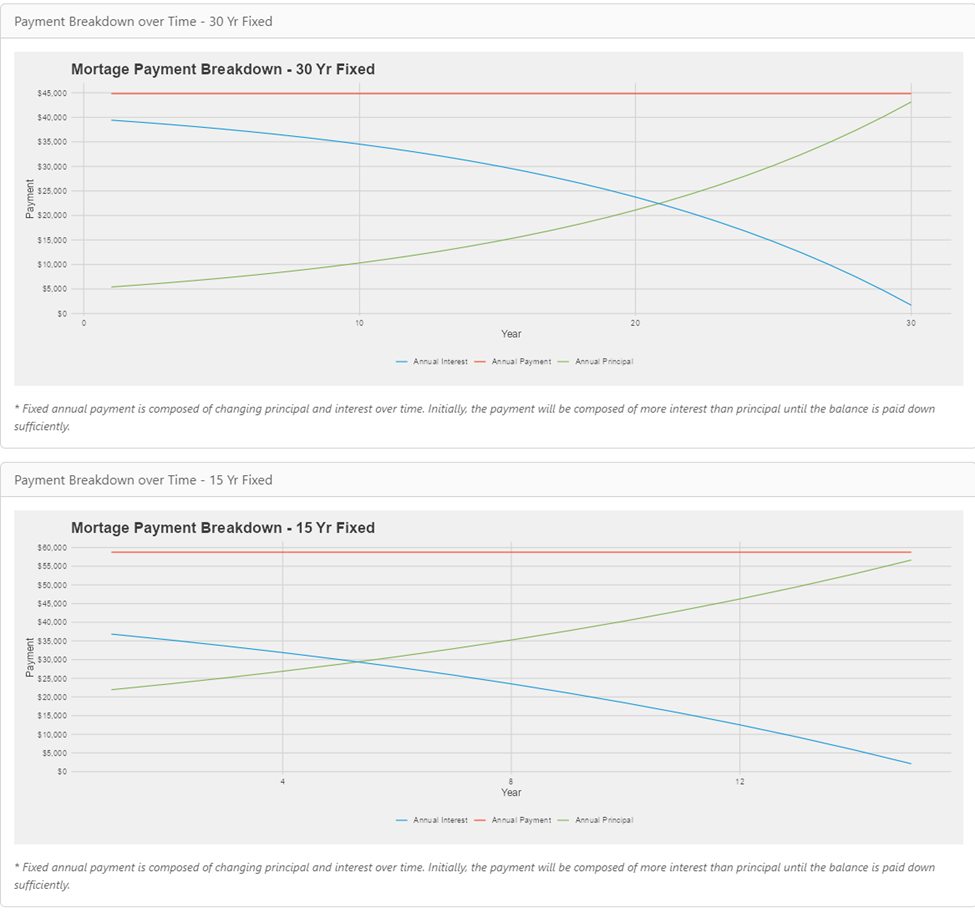
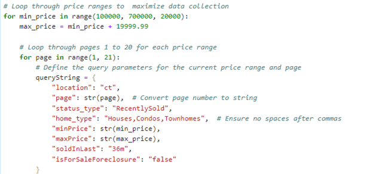

# homebuydee
HomeBuyDee project and deliverables. 

Home BuyDee: Your Home Buying Buddy!
Read Me File
Team Members
Project Manager:	Erich Mitchell
Dev. Lead:	Jason Dedas
Report Lead:	Landon Jones III
Investment Operations:	Mirrin McDougald

Problem Statement
This project aims to deliver value to our realtor client by generating realistic home buying estimates for potential clients residing in the top 30 cities in CT. These estimates will be based on client-desired home characteristics, economic indicators such as home price indices, and anticipated changes in interest rates. Clients will receive a comprehensive report detailing the optimal purchase time within a 6–12-month period and value tailored to their specific financial situation.

Interface
Landing Page –
The interface begins with the Home BuyDee Landing Page, which provides a general introduction to what Home BuyDee is about. This page includes navigation links to help users move between different sections of the application. The Home BuyDee branding logo is prominently displayed here.

Value Predictor – 
The Value Predictor page starts out blank, with preloaded placeholders where visuals will be displayed. Users can input their desired home location and characteristics using the search options on the left-hand side of the page.

 
After entering their preferences, users click the "Generate Value" button. 
The first visual to display is the "Predicted Home Price", which provides a predicted home value with a 90% confidence interval based on the user’s inputs.
The "Prediction Value" offers a value assessment of the predicted home price. If the value is over 1.00, it indicates a good deal based on a value/price ratio compared to other homes in the selected area—higher numbers are better.
The "Recent Sales" visual provides a text summary of recent home sales data that the model used to generate the predicted values. This text is based on a series of if/else statements and outputs tailored to the user's inputs.
The "Sample Home" visual identifies a home from the dataset that closely matches the user's inputted criteria and displays an image to show what a similar home could look like.
 

At the bottom of the page, the "Average Home Prices Over Time" visual shows a line graph with three ranges of home values: <$250k, $250k-$500k, and >$500k. The graph shows home value trends over a three-year timeline. Due to varying data points across cities, some trends may not cover the entire period.
 

Readiness Calculator – 
The final page is the Readiness Calculator, which evaluates the user's financial readiness to purchase a home at the predicted price from the Value Predictor page. The page initially loads with blank visual boxes and auto-populates the predicted home value in the "Home Price" input field. Users can adjust other values such as down payment percentage, monthly income, and monthly debt obligations.
 

After entering their values, users click the "Calculate Readiness" button to generate the visuals:
•	"Summary": Provides an overview of user inputs and clearly indicates whether a 30-year or 15-year fixed-rate mortgage would be affordable based on the most recent mortgage rates (Fannie Mae, MBA US FRM 30-Year Effective Rate, MBA US FRM 15-Year Effective Rate). The affordability readout options are Affordable, Stretching, or Aggressive.
•	"Interest Rates": Predicts upcoming interest rate trends based on historical patterns, suggesting when might be a good time to buy.
•	"Payments": Shows a projection of mortgage payments based on current and predicted interest rates, including the monthly dollar difference.
•	"Affordability": Uses the Debt-To-Income (DTI) ratio benchmark of 36% or less for housing costs. The readout options are Affordable (<36% DTI), Stretching (36%-43% DTI), or Aggressive (>43% DTI), indicating the user's financial flexibility or strain.
 

At the bottom of the page, two line graphs display 15-year and 30-year fixed mortgage payment timelines, highlighting the point where payments shift primarily from interest to principal.
 

Data Extraction
This project started with the data extraction, collection, and consolidation from our data sources. The file input and output paths will need to be updated for each file to match where the user plans to store the source files and file outputs. The user will also need to create their own API key with RapidAPI.com.

Zillow Sales Data – property search details steps are outlined below

Zillow Property Extended Search – 
zl_prop_ext_search_final.ipynb
https://zillow-com1.p.rapidapi.com/propertyExtendedSearch
The property extended search was used to extract basic home characteristics, pricing, and the ZPID. The total count is based on the instances per page and the total page count extracted using the API. We limited the price range to $100k-$700k to ensure a targeted price range for more accurate predictions. The script loops through the API's 20-page maximum limitation per call, increasing by $20k increments between $100k and $700k to maximize the initial data pull. Filters were also applied to get the target timeline, home type, and status. The python script concludes by producing a CSV file named zillow_properties.csv. User will need to create their own API key to run the steps.

Zillow Property Details – 
zillow_property_details_by_zpid.ipynb // zillow_prop_by_zpid.py
https://zillow-com1.p.rapidapi.com/property?zpid=
The initial data pull provided the team with the ZPID (Zillow Property Identifier). To obtain more detailed information for each home, the team had to make a second API call using the property details. The property details API allowed for one ZPID to be entered at a time, necessitating the code to loop through all 24,600 records from the extended search API and save those records to a list. A ½ second sleep time was added to prevent issues with the API calls per second limit. 
The property details included every available data point for each record, such as garage availability, parking spaces, attic, basement, distance to schools, school ratings, HOA fees, etc. The script concluded by producing a CSV file named property_details.csv. Due to the large size of the list, Jupyter Notebook failed, requiring us to run the script in the terminal as a Python file. The csv has been filtered to include only cities that have 200+ data points to limit size on GitHub. 

Zillow Combine Property Details - 
zillow_combine_prop_details.ipynb
Combine the two csv files into one by matching on the ZPID, drop any rows that are blank (na), and output the property_details_combined.csv. 

Zillow Properties Combined Cleaning - 
zillow_property_details_combined_cleaning.ipynb
The next step in the process was to clean the combined data. This included separating out different groupings of information. The different groupings included address, tax history, and resoFacts. Each was extracted and put into its own csv file. 

Zillow ZPID Histories Breakouts - 
Since some of the data was stored in JSON format within a single cell in the csv files, we needed to separate the instances out into a usable format. The following py files produced the csv files for schools, tax history, and price history. Some manual cleaning was still necessary after the breakouts were complete to get everything into a usable format.
•	zillow_schools_by_zpid.py
•	zillow_tax_history_by_zpid.py
•	zillow_price_history_by_zpid.py

Financial Datasets -

Financial indices were pulled down from Bloomberg. The initial pull included pricing datapoints historically from 6/30/2004 to the most recent price available. The timing of pricing for the various indices is daily, monthly and quarterly.  The pricing was projected over the null periods for data completeness. Mortgage rates for 15-year fixed rate and 30-year fixed rate mortgages were used as a base line as these are among the most common mortgage products and the ones most consumers select. They also both have an extended track record (started in 1990 vs a 2011 start for the 5-year adjustable-rate mortgage). Jumbo mortgages and specialized offerings (FHA) were outside the scope of our targeted price range or scope of our initial version offering. 

AllExpanded.csv

The indices were analyzed using orange and excel to identify any relationships.  The Fannie Mae US Home Mortgage Originations NSA (FANNORIG), and S&P CoreLogic Case-Shiller US National Home Price NSA Index (SPCSUSA) were chosen to use in the model along with MBA US FRM 30-Year Effective Rate (MB30ER) and MBA US FRM 15-Year Effective Rate (MB3015ER) mentioned above.
•	15_year_rate_forecast.csv
•	30_year_rate_forecast.csv
•	Mortgage originations (mort_orig.csv)
•	Case Shiller Index (case_shiller.csv)

MBA US FRM 30-Year Effective Rate (MB30ER) and MBA US FRM 15-Year Effective Rate (MB3015ER) were used to build the interest rate forecast model.  The Effective Rate Index tracks the average rate that lenders are offering for a 30 (15) year fixed rate mortgage.  The rates are an average of the rates offered to borrowers in a given week or 7-day period.  A forecast model was built in excel using each rate’s track record with a 10-year history.  The rate for each interest rate was projected out to 1/31/2025 for each forecast. 

 
Application

App/HomeBuydee Model.Rmd

Before creating the user interface for HomeBuydee, the predictive model for CT home prices needed to be developed. This was done in two main sections of the bolded file above – data loading and preparation, and predictive model fitting. Each step along the way is detailed with a comment line beginning with a “#”.
In the data loading and preparation section, the first step was to load each selected data file produced from the sections above. Some mild cleaning operations and data type corrections were applied immediately after loading. These cleaned datasets were then saved off in separate files. Building from the cleaned datasets, rolling sums, lags, and pivots were performed to get the data in a final format where each could be joined into a ‘final’ combined dataframe object. 
Moving into the predictive model section, the data was first split into training and test datasets with a 70/30 ratio. Relevant character features were converted to factor types so different categories could be used in the GLM. The model was then fit using a variety of features until a final pool of columns was selected and saved into a full prediction file for use in the application interface.

App/HomeBuydee Interface.R

In Shiny application development within R, there are 3 main sections: general pre-interface object loading, the interface itself, and the server functions. At the start of the script, the predictive model and financial forecasts are loaded for use later. These only run once and are stored in memory.
The first main section of the Shiny application is the user interface. This section defines all the different page views and user inputs. There are references to server variables which dynamically populate elements of the app, typically called with some form of xOutput(‘some_variable_name’). Each section is labeled with a line beginning with a “#”.

The final section of the Shiny application is the server containing reactive functions. These functions ‘watch’ for different events and update the user interface presented to the screen. Four reactive functions dictate how the application responds to users:
1.	‘update_prediction’ - this section is responsible for running the loaded predictive model and creating all card content on the Value Predictor page of HomeBuydee.
2.	‘home_down_payment’ - this section acts as a convenience utility to dynamically present the actual dollar amount down payment associated with a particular percentage.
3.	‘mthly_debt’ - this section acts as a guardrail to prevent users from entering monthly debt larger than monthly income.
4.	‘generate_report’ -   this section is responsible for running the mortgage amortization and generating all report content on the Readiness Calculator page of HomeBuydee.
